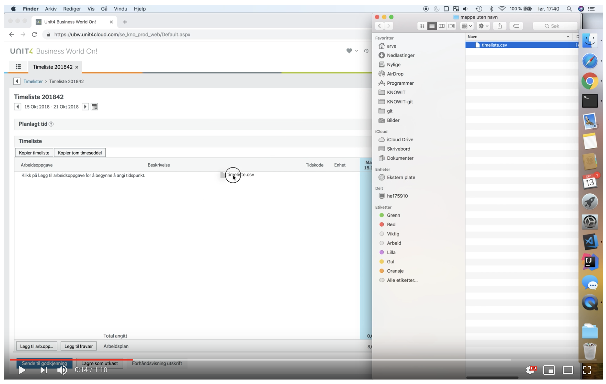
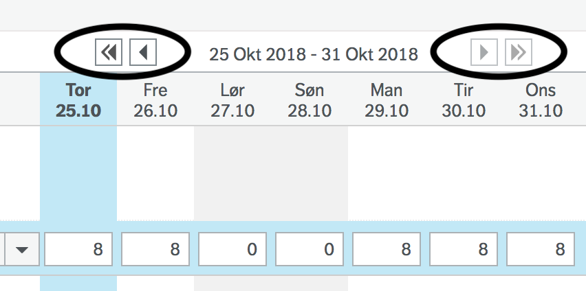

# Unngå UBW

Importer timeliste til UBW fra tekstfil med [tab-separerte verdier](https://en.wikipedia.org/wiki/Tab-separated_values).

[](https://www.youtube.com/watch?v=vziWaZY4MsQ)


## Installere

### Firefox
1. [Last ned uubw](https://github.com/arve0/uubw/releases) (`.xpi`).
2. Gå til `about:addons`.
3. Trykk tannhjulet → *Innstaller utvidelse fra fil*.
4. Velg den nedlastede xpi-filen.

### Chrome
1. Klon uubw: `git clone https://github.com/arve0/uubw`
2. Gå til chrome://extensions/.
3. Slå på utviklermodus.
4. Trykk på *Last inn upakket*.
5. Velg mappen til uubw.


## Bruk

1. Lag timeliste i [TSV](https://en.wikipedia.org/wiki/Tab-separated_values) eller et regneark.

	```tsv
	;Arbeidsordre	Aktivitet	Beskrivelse     	man	tir	ons	tor	fre	lør	søn
	32010000-1  	-       	Føre timer i UBW	100
	32010000-1  	-       	Drikke kaffe    	  	8
	32010000-1  	-       	Profiiiiiit     	  		8
	ABSENCE     	-       	Lunsj for de med	0,5	0,5	0,5	0,5	0,5
	ABSENCE     	-       	Lunsjpenger     	1 	1 	1 	1 	1
	```

2. Åpne timeføringen i UBW.
3. Dra over TSV-filen til UBW.
4. Drikk kaffe og profiiiiiiit.


## Filformat TSV

- Linjer som starter med `;` blir ignorert.
- Verdiene er separert med tab.
- La arbeidsordre som ikke har aktivitet være tom, eller bruk `-`.
- Timene blir fylt en kolonne av gangen. Det vil si at første kolonne vanligvis
  er mandag, så kommer tirsdag, osv.
- Mellomrom før og etter verdier blir fjernet.


## Fravær

Bruk arbeidsordre `ABSENCE` for å legge inn fravær. Beskrivelsen brukes til å
velge riktig type fravær.


## Korte og lange uker

Noen uker er ekstra lange. Eksempelvis uke 43 i 2018, som er fra 22. oktober til 31. oktober.
For lange uker trengs ekstra kolonner for å føre timene:

```tsv
;arbordre	aktivitet	beskrivelse	man	tir	ons	tor	fre	lør	søn	man	tir	ons
32010000-1	-       	Lese epost	8	8	8	8	8			8	8	8
```

Når timene føres vil de ikke bli synlig. En må navigere seg i kalenderen
for å kontrollere timene for alle dagene:



Tilsvarende blir det for kort uke, bare med færre kolonner i TSV-filen. Om en fører i
for mange kolonner, vil UBW vise summen, men når en lagrer valideres og korrigeres
timelisten.


## Lisens

Copyright Arve Seljebu
